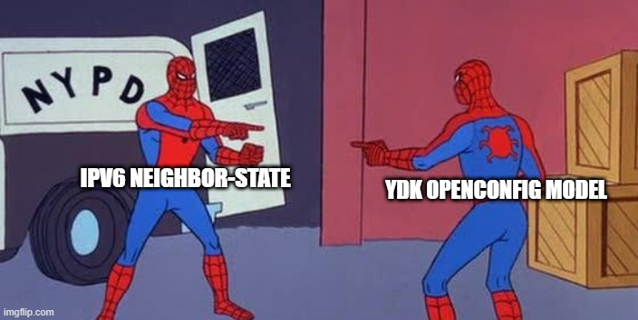

There are many tools out there that automatically create python classes based on Yang models (eg. Cisco YDK/YDK-gen, pyyangbind, etc...) but these tools can be so painful due to not being updated, not supporting a specific yang model or just generating the python classes in a mental structure to the point where creating your data validation models is probably better done by hand at this point. In this post, I hopefully demonstrate that reinventing the wheel is a great way to 1. waste your time (in a good way) and 2. Get better at Python if you're like me and don't write Python on a daily basis.

We will explore OOP in python to let us extend our code to different vendors and structure a project in a way that makes sense to gather data from either a vendor specific model or openconfig model using Netconf. Firstly, lets start with the project structure and basic idea of the code.

```
device_drivers
  cli
    generic.py
    vendors
      cisco
      vendorX
      vendorY
  netconf
    generic.py
    vendors
      cisco
      openconfig
      vendorX
      vendorY
```

A device driver follows the concept of either being CLI or NETCONF, CLI depending on a module such as Paramiko or Netmiko and NETCONF device_drivers depending on ncclient.

Each device driver has a generic driver which implements common logic among all vendors, either by extending the existing functionality in the modules being used (eg. Netconf get_config automatically returning the .data_xml string or decoding the XML to JSON and always returning the response via JSON/python dict for any vendor)

Each vendor device_driver will inherit the generic device driver, but implement the vendor specific XML structure to gather the relevant data and possibly normalize it so data from each vendor is almost "vendorless" with the exception of any configuration that is vendor specific.

Our Netconf generic driver will be called `GenericNetconfDriver` and any vendor specific driver can either follow the pattern of the OS name + version or simply the OS name (eg. cisco.py will contain `IOSXENetconfDriver` and `IOSXRNetconfDriver`). Let's start with our generic netconf driver.

[device_drivers\netconf\generic.py](../lab-configs/2022-08-02-python-netconf-for-network-engineers/generic_netconf_driver_1.py)
```
from ncclient import manager


class GenericNetconfDriver:
    """Generic NETCONF driver which implements common logic across all vendors.

    All Vendor drivers must inherit this class.

    Arguments:
        host:           IP or Domain Name of the device
        port:           NETCONF Port
        username:       NETCONF Username
        password:       Optional Password
        hostkey_verify: Uses ~/.ssh/known_hosts to verify SSH host keys
        look_for_keys:  Attempts to use any keys with path '~/.ssh/id_*'
        kwargs:         Keyword arguments which will be passed to ncclient connect() method
    """

    def __init__(
        self,
        *,
        host: str,
        port: int = 830,
        username: str,
        password: str = "",
        hostkey_verify: bool = False,
        look_for_keys: bool = False,
        **kwargs
    ) -> None:
        self.host = host
        self.port = port
        self.username = username
        self.password = password
        self.hostkey_verify = hostkey_verify
        self.look_for_keys = look_for_keys
        self.session = None
```

Some optional arguments can be avoided if you want to only use SSH key based authentication and not give the user an option to attempt password authentication however this will suit our needs. I have commented the purpose of each argument, each vendor specific netconf driver will inherit these arguments and can be used to establish the netconf session.

`self.session = None` will hold the ncclient `manager.connect()` method which will then allow us to interact with the various netconf operations like .get(), .get_config() and .edit_config(). Let's implement a connect method in our generic netconf class to handle the authentication and connection to the device, the reason why I am doing this is incase we ever want to change generic connect method for all vendors, I can simply change it from this base generic class and all the other vendors will inherit this behaviour.

[device_drivers\netconf\generic.py](../lab-configs/2022-08-02-python-netconf-for-network-engineers/generic_netconf_driver_2.py)
```
def connect(self, **kwargs) -> None:
    if self.session:
        return self.session

    self.session = manager.connect(
        host=self.host,
        port=self.port,
        username=self.username,
        hostkey_verify=self.hostkey_verify,
        look_for_keys=self.look_for_keys,
        **kwargs
    )

    return self.session
```

Note that we are not catching any potential errors that ncclient could throw (such as SSHExceptions, Authentication exceptions, Timeout exceptions etc...). If we create a test script in our root directory that imports this generic netconf driver and try to interact with the ncclient `connect()` method that we store in our `self.session`, we can verify that our session is created and a `get_config()` works as expected.

```
from device_drivers.netconf.generic import GenericNetconfDriver
from argparse import ArgumentParser

parser = ArgumentParser(
    description="Test NETCONF calls against vendor specific devices using openconfig or vendor specific XML/yang models"
)

parser.add_argument(
    "--host", type=str, help="IP address of NETCONF endpoint", required=True
)
parser.add_argument("--username", type=str, help="NETCONF Username", required=True)
parser.add_argument("--password", type=str, help="NETCONF Password", required=True)

arguments = parser.parse_args()

device = GenericNetconfDriver(
    host=arguments.host,
    username=arguments.username,
    password=arguments.password,
)

device.connect(password=device.password)

config = device.session.get_config(source="running")
print(config)
```

Let's confirm an XML filter works for our device, currently we are testing against Cisco IOS-XR which presents the `interfaces` configuration in the root tree of the XML, let's quickly create our IOS-XR class that inherits the `GenericNetconfDriver` and create a method that filters out the running configuration for the interfaces. This vendor specific class will need all the relevant arguments + keyworded arguments passed into our `GenericNetconfDriver` which can be solved using the `super()` method like below:

[device_drivers\netconf\vendors\cisco.py](../lab-configs/2022-08-02-python-netconf-for-network-engineers/iosxr_netconf_driver_1.py)
```
from device_drivers.netconf.generic import GenericNetconfDriver


class IOSXRNetconfDriver(GenericNetconfDriver):
    def __init__(self, *args, **kwargs) -> None:
        super().__init__(*args, **kwargs)
```

Our next test script ([test_iosxr.py](../lab-configs/2022-08-02-python-netconf-for-network-engineers/test_iosxr.py)) will look exactly the same as the original test.py in the root directory but will import this new `IOSXRNetconfDriver`. Let's implement functionality to filter the interfaces per IOS-XR XML structure:

[device_drivers\netconf\vendors\cisco.py](../lab-configs/2022-08-02-python-netconf-for-network-engineers/iosxr_netconf_driver_2.py)
```
def get_interfaces_config(self) -> str:
    xml_filter = """
    <interfaces xmlns="http://cisco.com/ns/yang/Cisco-IOS-XR-um-interface-cfg">
        <interface/>
    </interfaces>
    """
    response = self.session.get_config(
        source="running", filter=("subtree", xml_filter)
    )
    return response.data_xml
```

The XML namespaces can be found looking at the YANG models, Cisco IOS-XR are still moving a lot of their yang models to the "unified model" which start with `Cisco-IOS-XR-um-*`. Running the get_interfaces_config() on our 2nd test script outputs all the interfaces for an IOS-XR device as shown below:

```
  python .\test_iosxr.py --host 192.0.2.2 --username myUsername --password myPassword

<?xml version="1.0" encoding="UTF-8"?><data xmlns="urn:ietf:params:xml:ns:netconf:base:1.0" xmlns:nc="urn:ietf:params:xml:ns:netconf:base:1.0">
  <interfaces xmlns="http://cisco.com/ns/yang/Cisco-IOS-XR-um-interface-cfg">
   <interface>
    <interface-name>GigE0/0/0/0</interface-name>
    <shutdown/>
   </interface>
   <interface>
    <interface-name>GigE0/0/0/1</interface-name>
    <shutdown/>
   </interface>
   <interface>
    <interface-name>GigE0/0/0/2</interface-name>
    <shutdown/>
   </interface>
   !! === output omitted === !!
  </interfaces>
 </data>
```

What if you're using a few vendors that all support the OpenConfig interfaces model? OpenConfig should be considered `generic` in our case, however we will still create a separate Python class. Remember that the full structure of the code is available within the [lab-configs directory](../lab-configs/2022-08-02-python-netconf-for-network-engineers/).

[device_drivers\netconf\openconfig.py](../lab-configs/2022-08-02-python-netconf-for-network-engineers/openconfig_netconf_driver_1.py)
```
from device_drivers.netconf.generic import GenericNetconfDriver


class OpenConfigDriver(GenericNetconfDriver):
    def __init__(self, *args, **kwargs) -> None:
        super().__init__(*args, **kwargs)

    def get_interfaces_config(self) -> str:
        xml_filter = """
        <interfaces xmlns="http://openconfig.net/yang/interfaces">
            <interface/>
        </interfaces>
        """
        response = self.session.get_config(
            source="running", filter=("subtree", xml_filter)
        )
        return response.data_xml
```

We can extend this existing method so that whoever imports this module and uses it, can define a specific list of interfaces they want to filter. Let's add a separate method called `get_interface_config` which takes an argument to filter the interface name.

[device_drivers\netconf\openconfig.py](../lab-configs/2022-08-02-python-netconf-for-network-engineers/openconfig_netconf_driver_2.py)
```
def get_interface_config(self, interface: str) -> str:
    xml_filter = f"""
    <interfaces xmlns="http://openconfig.net/yang/interfaces">
        <interface>
            <name>{interface}</name>
        </interface>
    </interfaces>
    """
    response = self.session.get_config(
        source="running", filter=("subtree", xml_filter)
    )
    return response.data_xml
```

Running the [test script located here](../lab-configs/2022-08-02-python-netconf-for-network-engineers/test_openconfig_interface.py) now presents us with the data for a specific interface.

```
python .\test_openconfig_interface.py --host 192.0.2.1 --username myUsername --password myPassword --interface TwentyFiveGigE0/0/0/29

<?xml version="1.0" encoding="UTF-8"?><data xmlns="urn:ietf:params:xml:ns:netconf:base:1.0" xmlns:nc="urn:ietf:params:xml:ns:netconf:base:1.0">
  <interfaces xmlns="http://openconfig.net/yang/interfaces">
   <interface>
    <name>TwentyFiveGigE0/0/0/29</name>
    <config>
     <name>TwentyFiveGigE0/0/0/29</name>
     <type xmlns:idx="urn:ietf:params:xml:ns:yang:iana-if-type">idx:ethernetCsmacd</type>
     <enabled>false</enabled>
    </config>
    <ethernet xmlns="http://openconfig.net/yang/interfaces/ethernet">
     <config>
      <auto-negotiate>false</auto-negotiate>
     </config>
    </ethernet>
   </interface>
  </interfaces>
 </data>
```

So far, we're moving at a really fast pace and I haven't exactly explained why are we making it so complicated? Why not just have separate scripts per vendor instead of doing all this non-network engineer friendly OOP and class inheritance. Take a scenario where we actually want to ensure our `get_config()` response no matter the vendor, returns us a python dictionary instead of working with an XML string and having to perform things like xpath filters. We could simply use a python module to get the XML into a dictionary however this handles no data validation (eg. 1 interface entry might be converted to a dictionary but us humans, know "interfaces" -> "interface" that each interface must be a separate list entry... if we use a module like `xmltodict` (install it using `pip install xmltodict`), it won't be able to figure this out for us). I'll demonstrate this by firstly, implementing a `get_config` method for our `GenericNetconfDriver` which will perform all this logic, then we will change our IOSXR and OpenConfig drivers to use `self.get_config` (our own method) instead of `self.session.get_config` (the ncclient method).

[device_drivers/netconf/generic.py](../lab-configs/2022-08-02-python-netconf-for-network-engineers/generic_netconf_driver_3.py)
```
from xmltodict import parse

# Here we pass *args and **kwargs in case any specific function needs to change something like the datastore source from "running" to "candidate".
def get_config(self, *args, **kwargs) -> dict:
    response = self.session.get_config(*args, **kwargs)
    parsed_response = parse(response.data_xml)
    return parsed_response
```

Because we have some logic in our vendor specific drivers to return the `.data_xml` of the response, we need to edit multiple functions. This is why its best to keep all the logic in the `generic.py` which relates to parsing and interacting with the ncclient objects like the NetconfResponse. In this case we will edit our `OpenConfigNetconfDriver` methods.

[device_drivers/netconf/openconfig.py](../lab-configs/2022-08-02-python-netconf-for-network-engineers/openconfig_netconf_driver_3.py)
```
def get_interfaces_config(self) -> str:
    xml_filter = """
    <interfaces xmlns="http://openconfig.net/yang/interfaces">
        <interface/>
    </interfaces>
    """
    response = self.get_config(source="running", filter=("subtree", xml_filter))
    return response

def get_interface_config(self, interface: str) -> str:
    xml_filter = f"""
    <interfaces xmlns="http://openconfig.net/yang/interfaces">
        <interface>
            <name>{interface}</name>
        </interface>
    </interfaces>
    """
    response = self.get_config(source="running", filter=("subtree", xml_filter))
    return response
```

If we compare the XML string with the xmltodict attempt to parse the XML to a dictionary for a simple interface, this is what it will look like for the interface we have been testing in the OpenConfig model:

```
python .\test_openconfig_interface.py --host 192.0.2.1 --username myUsername --password myPassword --interface TwentyFiveGigE0/0/0/29

# XML
<?xml version="1.0" encoding="UTF-8"?><data xmlns="urn:ietf:params:xml:ns:netconf:base:1.0" xmlns:nc="urn:ietf:params:xml:ns:netconf:base:1.0">
  <interfaces xmlns="http://openconfig.net/yang/interfaces">
   <interface>
    <name>TwentyFiveGigE0/0/0/29</name>
    <config>
     <name>TwentyFiveGigE0/0/0/29</name>
     <type xmlns:idx="urn:ietf:params:xml:ns:yang:iana-if-type">idx:ethernetCsmacd</type>
     <enabled>false</enabled>
    </config>
    <ethernet xmlns="http://openconfig.net/yang/interfaces/ethernet">
     <config>
      <auto-negotiate>false</auto-negotiate>
     </config>
    </ethernet>
   </interface>
  </interfaces>
 </data>

# xmltodict.parse() method
{
    "data": {
        "@xmlns": "urn:ietf:params:xml:ns:netconf:base:1.0",
        "@xmlns:nc": "urn:ietf:params:xml:ns:netconf:base:1.0",
        "interfaces": {
            "@xmlns": "http://openconfig.net/yang/interfaces",
            "interface": {
                "name": "TwentyFiveGigE0/0/0/29",
                "config": {
                    "name": "TwentyFiveGigE0/0/0/29",
                    "type": {
                        "@xmlns:idx": "urn:ietf:params:xml:ns:yang:iana-if-type",
                        "#text": "idx:ethernetCsmacd"
                    },
                    "enabled": "false"
                },
                "ethernet": {
                    "@xmlns": "http://openconfig.net/yang/interfaces/ethernet",
                    "config": {
                        "auto-negotiate": "false"
                    }
                }
            }
        }
    }
}
```

Now compare that to the `get_interfaces_config()` method which should automatically appear as a dictionary because our `GenericNetconfDriver` method will parse the XML response and return the dictionary. You can see the snippet of "interface" key is actually a list and not a dictionary:

```
{
    "data": {
        "@xmlns": "urn:ietf:params:xml:ns:netconf:base:1.0",
        "@xmlns:nc": "urn:ietf:params:xml:ns:netconf:base:1.0",
        "interfaces": {
            "@xmlns": "http://openconfig.net/yang/interfaces",
            "interface": [       <=========== Here
                ..... output omitted
```

As per the OpenConfig Interfaces YANG model:

```
container interfaces {
      description
        "Top level container for interfaces, including configuration
        and state data.";


      list interface {
        key "name";

        description
          "The list of named interfaces on the device.";
```

At this point, I am hoping that you understand that there are tools out there that can handle these type of issues/scenarios such as data validation, handling the sessions, automatically creating objects based on the yang model so instead of getting the description of an interface using a dictionary for example:

```
for interface in interfaces:
    print(interface["description"]) # This part will break your code if the interface doesn't have a description, you can safely check if the dictionary key exists by using .get() method like the below example

    if interface.get("description"):
        print(interface["description"])
```

vs

```
for interface in interfaces:
    print(interface.description) # Prints None if no description, and we don't need to validate the key or access it via the dictionary using ["description"]
```

Let's move away from doing everything manually for now and take a look at the Cisco YDK. YDK-gen can be used to create the base python models from the relevant vendor specific YANG models but by default it comes with Cisco IOS-XE/XR/other platforms and the OpenConfig modules.

```
from ydk.services import CRUDService
from ydk.providers import NetconfServiceProvider
from ydk.models.openconfig import openconfig_interfaces as oc_interfaces

provider = NetconfServiceProvider(
    address="192.0.2.2",
    port=830,
    username="myUsername",
    password="myPassword",
    protocol="ssh",
)

crud = CRUDService()

interfaces = oc_interfaces.Interfaces()
interfaces = crud.read(provider, interfaces)

print(interfaces)
```

However you then get reminded why people are still screen scraping in 2022 or implementing their own tools because these amazing tools end up not working because they are either not updated (or the YANG models are not updated) :-) :

```
(venv)scripts# python test.py 

Traceback (most recent call last):
  File "/root/venv/lib/python3.8/site-packages/ydk/errors/error_handler.py", line 50, in handle_runtime_error
    yield
  File "/root/venv/lib/python3.8/site-packages/ydk/services/crud_service.py", line 88, in _crud_read
    read_top_entity = crud_call(provider, top_filters)
RuntimeError: YModelError: Invalid value "GLEAN" in "neighbor-state" element. Path: /openconfig-interfaces:interfaces/interface[name='BVI456']/subinterfaces/subinterface[index='0']/openconfig-if-ip:ipv6/neighbors/neighbor[ip='2001:db8:0:32::39']/state/neighbor-state

During handling of the above exception, another exception occurred:

Traceback (most recent call last):
  File "test2.py", line 16, in <module>
    interfaces = crud.read(provider, interfaces)
  File "/root/venv/lib/python3.8/site-packages/ydk/services/crud_service.py", line 60, in read
    return _crud_read(provider, read_filter, False, self._crud.read)
  File "/root/venv/lib/python3.8/site-packages/ydk/services/crud_service.py", line 88, in _crud_read
    read_top_entity = crud_call(provider, top_filters)
  File "/usr/lib/python3.8/contextlib.py", line 131, in __exit__
    self.gen.throw(type, value, traceback)
  File "/root/venv/lib/python3.8/site-packages/ydk/errors/error_handler.py", line 69, in handle_runtime_error
    raise _exc
ydk.errors.YModelError:  Invalid value "GLEAN" in "neighbor-state" element. Path: /openconfig-interfaces:interfaces/interface[name='BVI456']/subinterfaces/subinterface[index='0']/openconfig-if-ip:ipv6/neighbors/neighbor[ip='2001:db8:0:32::39']/state/neighbor-state
```

You can't blame the YDK here because it's actually working as intended at this point. The [Openconfig model](https://github.com/YangModels/yang/blob/main/vendor/cisco/xr/742/openconfig-if-ip.yang#L614) doesn't implement an enum value for `GLEAN`, only:

- INCOMPLETE
- REACHABLE
- STALE
- DELAY
- PROBE

So as per Openconfig model, this data is actually invalid, and you wonder why people still aren't adopting IPv6? Cisco, pull your finger out your ass and stop returning bad values for the Openconfig model... I don't want to be locked into your vendor specific "unified model" yang models. Do we manually change the YANG model and add the "GLEAN" as a new enum entry and recompile the yang model using YDK-Gen (don't do this please...) or do we implement some horrible workaround to filter out this specific data using a YFilter when we call `crud.read()`?



At this point, I'm burned out with this blog. You can find the full python files for this project [here](../lab-configs/2022-08-02-python-netconf-for-network-engineers/full_project/) which includes all the test scripts to print data for IOS-XR and Openconfig yang models. That ipv6 part has really pissed me off at this point of the blog and is one of the reasons why I reinvent the wheel in my own scripts and create my own generic driver per vendor and extend it using Python classes. Validation is still something we haven't covered but I actually do all my validation using Pydantic models, a introduction to Pydantic [can be found here](https://pydantic-docs.helpmanual.io/). It heavily depends on python type annotations like this:

```
from typing import Optional
from pydantic import BaseModel, constr

class Interface(BaseModel):
    id: Optional[int]
    name: constr(max_length=64)
    mtu: Optional[int]
    enabled: Optional[bool] = False
```