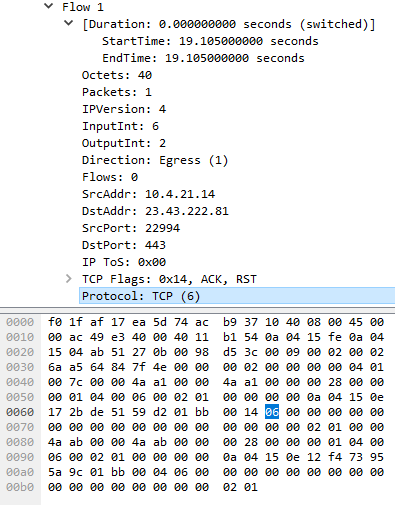

> I apologize in advanced for the amount of images and config snippets, I prefer images over text... :-)

I want to build a system that collects flow logs using multiple collectors, stores those logs in a database and then compress that data after a given time. Here is the basic architecture that we will be going for:


ps. the Load Balancer design changes slightly as its not great to attempt to load balance purely on UDP alone, in case 1 collector gets the Netflow Template FlowSet and the other collector gets the Netflow Data FlowSet, the 2nd collector won't be able determine the field keys/what each field should map to. We talk about this scenario later in the post.


- Netflow Exporter
- Load balancer/Netflow replicator (UDP load balance/to replicate NetFlow Template RecordSets)
- Collectors will be running [pmacct](http://www.pmacct.net/) which allows us to ingest the netflow data and easily export it into different data formats, depending on how we want to pull the data in the future, we could export it to JSON and store it into a TSDB like InfluxDB or Prometheus so that we can utilize the data with Grafana, but it also has native support to export to MySQL, RabbitMQ and Kafka.
- DB Cluster might be optional as we may need to write a script to parse the JSON and input into the TSDB, however we will explore MySQL first and maybe move onto storing the data in a TSDB and getting a dashboard running with Grafana in another separate post.

## Initial notes

It might be obvious to the reader but the more traffic flows in the network then the more netflow records that will be captured. We can typically define the sampling rate at which packet is sampled and sent to the collectors so in theory the more samples, the more CPU processing power required and more storage requirements to store those flows. Before we dive into sampling rates lets talk about why the UDP load balancer?

### Load Balancing

Load balancing based on a destination UDP port (eg. packet 1 to UDP port 9995 goes to server-A, packet 2 to UDP port 9996 goes to server-B) is not very complicated vs diving into the data and attempting to process the data and selecting specific headers/fields to further process. If I handed you a letter and said post it in that letter box over there, pointed in the direction and even told you the specific door that was blue and had number 9995 on it, you'd be pretty confident in your ability to do this right? What if instead, I handed you a letter and told you exactly all the same details, but then asked you if you could open up the letter which was a long list of scrambled words, you had to attempt to rearrange the letters for each word to make sense of it and then knock at the door and say those words aloud... but then while doing that, I gave you another letter to deliver at number 9995 on a different street before you've even finished?

My point is that we could simply deliver these letters and allow the home owner to process their own letter individually. Now this wouldn't be a very fast method if you have to load balance hundreds or even thousands of letters each second, but in terms of UDP packets, a load balancer is perfect in this type of situation. A netflow record sent by our exporter can simply be redirected to a group of collectors and we can continue forwarding these packets and letting the collectors scale out based on the workload, this we won't cover but you can always find ways of labbing this based on autoscale features (eg. horizontal vs vertical) [implemented by your orchestrator](https://kubernetes.io/docs/tasks/run-application/horizontal-pod-autoscale-walkthrough/).

### Sample Rates

So lets get back to Netflow sampling and the records themselves... What ratio do we want to use? What is the best ratio? Won't we lose a lot of insight the higher the ratio? Cloudflare documentation recommends the following for their "Magic Network Monitoring" product:

- Low Volume = 1:100 to 1:500 ratio
- Medium Volume = 1:1000 to 1:2000 ratio
- High Volume = 1:2000 to 1:4000 ratio
- Anything higher than 1:5000 ratio is where you start to notice inconsistency in the reported flows

Volumes are a bit vague however if you are building your own solution, I can only recommend to play with ratios and calculate storage requirements and resource requirements based on the collector (and even the exporter as more packets exported will utilize more processing power at the end of the day)

### Storage

We can get a rough calculation by taking the average flow size in a Netflow record, how many flows per second our network typically sees, maybe add a little bit of wiggle room and get some results. Since we are using NetFlow v9, we can look at documentation and already find there are many fields that can be included in a flow which might not all be populated, majority if not all collectors should let us define which fields we want to collect after processing the NetFlow packet, so therefore the actual size of the record in the packet itself might not equal the actual size of the flow stored in the database. I think we should quickly build an instance of our collector without the UDP load balancer, so we can investigate exactly what is sent in the majority of our flow records, do some quick calculations, store the record in the database, recalculate and then we'll move on with the project with the end setup.

# Lets get setup

Firstly, I'm going to configure my USG to export records with a 1:10 ratio as its only running in my home, run a test collector using docker and then perform a packet capture. pmacct provides some common vendor configurations such as [IOS-XE/XR, Juniper and other vendors in section Vc](https://github.com/pmacct/pmacct/blob/master/QUICKSTART#L701).

## USG Configuration

USG configuration will constantly be overwritten by the unifi controller so I'm going to store the configuration on the controller itself so it pushes the netflow config everytime it attempts to reconfigure my device:

1. Create a config file (or edit existing) located at: `/usr/lib/unifi/data/sites/default/config.gateway.json`
2. Configure netflow under system flow-accounting:

```json
{
   "system":{
      "flow-accounting":{
         "ingress-capture":"pre-dnat",
         "interface":[
            "eth0",
            "eth1"
         ],
         "netflow":{
            "sampling-rate":"10",
            "server":{
               "<ipv4 address because Unifi suck as don't support v6 for netflow export :( >":{
                  "port":"9995"
               }
            },
            "timeout":{
               "expiry-interval":"60",
               "flow-generic":"60",
               "icmp":"300",
               "max-active-life":"604800",
               "tcp-fin":"300",
               "tcp-generic":"3600",
               "tcp-rst":"120",
               "udp":"300"
            },
            "version":"9"
         },
         "syslog-facility":"daemon"
      }
   }
}
```

3. Force provision the USG via Unifi controller by selecting the USG -> Settings -> Manage -> Provision. Note that USG sucks and doesn't allow IPv6 flow exporter...

I'm going to quickly run a packet capture now just to see what arrives before deploying the collector container. In the below we have 2 packets, which look slightly different:


NetFlow packets will always contain common headers:

- Version (2 Bytes)
- Count (2 Bytes)
- System Uptime (4 Bytes)
- Timestamp in UNIX Seconds (4 Bytes)
- Flow Sequence (4 Bytes)
- Source ID (4 Bytes)

So we already know the NetFlow v9 packet will at least be >20 bytes


The template FlowSet is essentially a heads up to the collector: "When you get a Flow record (Data FlowSet), lookup the FlowSet ID and use a previous template you received to automatically map the field values". In our case, if we receive a Data FlowSet assigned to the ID of 1025, we'll know in our case that field #16 == PROTOCOL


Let's take a look at the Data FlowSet we received, it contains 2 flows and because they are apart of the same FlowSet, they use the same template (ID=1025) and handy Wireshark in our case can use that template to map the field values. If we didn't capture the template FlowSet before the actual records, then we wouldn't be able to decode this.


Note that if you dive into the byte level, only the VALUE itself exist, not the field name itself. The only reason we know this field in the packet = PROTOCOL is because of the Template. 06 in Hex = 6 in decimal and we can represent this value in our database as TCP or leave it as 6. [See pmacct (Netflow collector we will use) for this reference in a struct thats used to define common protocol values](https://github.com/pmacct/pmacct/blob/18ff70ee61bf6e50cd4bc10fda38c9fbfbee7a50/src/pmacct-data.h#L152).



# pmacct container and collecting some Netflow data

[pmacct](http://www.pmacct.net/) is a fantastic open source suite of tools and daemons which include capturing NetFlow traffic and processing it (nfacctd), in our case we will export it into a MySQL database and then potentially reconfigure it to use a message broker which we will then write a micro service to ingest the data and insert it into a TSDB like InfluxDB. While I am writing this sentence, it might be interesting to explore Netflow replication using pmacct directly to then be processed by remote collectors in the future. The problem I can see is that if we load balance netflow data blindly based on UDP port, the template set may be sent to 1 collector and the data will be sent to another so it might not be the best idea running NGINX with UDP load balancing.

## Docker Setup

### nfacctd daemon configuration
```
daemonize: false
nfacctd_port: 9995
nfacctd_time_new: true

plugins: print[test]

aggregate[test]: src_host, dst_host, src_port, dst_port, tcpflags, proto

```

#### docker-compose.yml
```
version: "3.8"

services:
  netflow_collector:
    image: pmacct/nfacctd:latest
    restart: unless-stopped
    ports:
      - 9995:9995/udp
    volumes:
      - ./nfacctd.conf:/etc/pmacct/nfacctd.conf:ro

```


We can change the print_output variable to another supported format for example: csv or json

nfacctd.conf
```
print_output: json
```


### Bonus section

These fields will always be present so lets try to perform some basic calculations based on how much storage a flow will take in our database, connect it up to a MySQL server and leave it running for a few days and look at the statistics of:

- Average flows per second/minute and hour
- Average size per flow stored in the database
- Average disk space on the MySQL server

If we take a look at the provided schema for [MySQL for NetFlow v9 here](https://github.com/pmacct/pmacct/blob/master/sql/pmacct-create-db_v9.mysql), it includes fields we don't really care about in this demonstration so lets cut back the fields like so:

db.sql
```
DROP DATABASE IF EXISTS pmacct;
CREATE DATABASE pmacct;

USE pmacct;

DROP TABLE IF EXISTS acct; 
CREATE TABLE acct (
    ip_src CHAR(45) NOT NULL,
    ip_dst CHAR(45) NOT NULL,
    port_src INT(2) UNSIGNED NOT NULL,
    port_dst INT(2) UNSIGNED NOT NULL,
    tcp_flags INT(4) UNSIGNED NOT NULL,
    ip_proto CHAR(6) NOT NULL,
	packets INT UNSIGNED NOT NULL,
	bytes BIGINT UNSIGNED NOT NULL,
	stamp_inserted DATETIME NOT NULL,
	stamp_updated DATETIME,
    PRIMARY KEY (ip_src, ip_dst, port_src, port_dst, ip_proto, stamp_inserted)
);
```

We can't simply add values and expect an average row size because storing: "1.1.1.1" as the ip_dst is actually less bytes than "192.0.2.1" even though we can store a total of 45 bytes in the ip_dst database column. So let's go for a "worst case" scenario, IPv4 addresses are max 15 bytes ("255.255.255.255") if stored with the decimal points, 11 bytes as an integer if we convert the IP as an integer, but what about IPv6 ("FFFF:FFFF:FFFF:FFFF:FFFF:FFFF:FFFF:FFFF") which is max 39 bytes? Someone however factored in IPv4 mapped IPv6 addresses where the max value would be "FFFF:FFFF:FFFF:FFFF:FFFF:FFFF:255.255.255.255" which adds up to 45 bytes.

- port fields have a max of 2 bytes (65535 max value)
- tcp_flags have a max of 1 byte (first 2 bits reserved, then URG, ACK, PSH, RST, SYNC and FIN)
- ip_proto has a max value of 6 bytes because we can store protocol 6 as `tcp` instead. But its recommended to change this to 1 byte integer (0-255) if storing protocol numbers
- packets and bytes are not required however they are if you want to accounting for the flows, lets just say the number of packets=`5` and bytes=`10,000` both stored as integers which are: 1 byte and 2 bytes
- stamp_inserted and stamp_updated = 10 bytes

So in total we have `45 + 45 + 2 + 2 + 6 + 1 + 2 + 10 + 10` = 123 bytes

Let's take a real scenario, an IPv4 DNS response from OpenDNS:

```
{
   "event_type":"purge",
   "ip_src":"10.4.22.100", # 11 bytes
   "ip_dst":"208.67.222.222", # 14 bytes
   "port_src":47555, # 2 bytes
   "port_dst":53, # 1 byte
   "tcp_flags":"0", # 1 byte
   "ip_proto":"udp", # 3 bytes
   "packets":1, # 1 byte
   "bytes":81 # 1 byte
}

# Total bytes plus the timestamps that will be added to the Database row = 54 bytes
```

Now we get into the realms of trying to average the row size of different types of traffic, a simple DNS request which may be lightweight will not have the same flow values for downloading a game or a flow which contains large payloads, increasing the packets the longer the flow and increasing the bytes the larger the file being downloaded/uploaded. I ill update this section in a few days when I have some data as my MySQL buffer pool is set to 128MB, after running this setup for 24 hours it didn't reach it so I should be able to determine the average storage from flows per minute (capturing mysql stats every minute on my Grafana/Prometheus setup).

#### Few Hours of logs

- First entry = 2023-06-11 21:10:00
- Last Entry = 2023-06-12 00:53:00
- Total number of records = 13195
- Total time = 3hr 43 mins (223 minutes)

Obviously don't do this in production because its not a great way to determine your average but in our case, we have around 59 records on average per minute.

The total size of our database table is 17833984 Bytes (17.8MB) if I check on disk, divide by 13195 total netflow entries in the database I get an average of 1351 bytes which is well above our "worse case scenario" @ 123 bytes. Anyway, probably something I am doing... If I change the database table `ROW_FORMAT` to `COMPRESSED` then it ends up being 7348224 bytes which is equal to an average of 556.89 bytes per row. Should I dare say changing the format compressed our single record by 58.68%?

Let's pretend our netflow exporter captures around 1 million flows per second with a 1:100 export ratio (so 100k flows) but lets take our worst case scenario, because I refuse to believe a single row takes up 556.89 bytes, I'll be nice and say 185 Bytes (this doesn't include indexing which should be factored in):

Without compression:

- Avg storage per Second: 100k FPS * 185 bytes = 17.64MB
- Avg storage per Minute: 17.64MB * 60 seconds = 1.05GB
- Avg storage per Day: 1.05GB * 60 mins * 24 hours = 1,512GB (1.47TB)
- Avg storage per Month: 1.47TB * 30 days = 44.1TB
- Avg Storage per Year: 45TB * 12 = 529.2TB
- Avg Storage for 3 years: 529.2TB * 3 = 1587.6TB (1.55PB)

With compression (58.68% baseline):
- Avg storage per Second = 10.35MB
- Avg storage per Minute = 630.92MB
- Avg storage per Day = 887.24GB
- Avg storage per Month = 25.87TB
- Avg Storage per Year = 310.53TB
- Avg Storage for 3 years = 931.6TB

### Storing the values in a database (MySQL)

Let's move on and build the MySQL database, connect our single instance of pmacct and leave it running for a bit. I will also create a Grafana dashboard to show us some db stats.

docker-compose.yml
```
version: "3.8"

services:
  netflow_collector:
    image: pmacct/nfacctd:latest
    restart: unless-stopped
    ports:
      - 9995:9995/udp
    volumes:
      - ./nfacctd.conf:/etc/pmacct/nfacctd.conf:ro
    depends_on:
      - nfdb

  nfdb:
    image: mysql
    restart: always
    env_file:
      - ./envs/mysql.env
    volumes:
      - ./database-init/:/docker-entrypoint-initdb.d

  # phpmyadmin can be removed if you don't want it...
  phpmyadmin:
    image: phpmyadmin/phpmyadmin
    container_name: pma
    links:
      - nfdb
    environment:
      PMA_HOST: nfdb
      PMA_PORT: 3306
      PMA_ARBITRARY: 1
    restart: always
    ports:
      - 8082:80

```

database-init/01-create-database.sql
```sql
DROP DATABASE IF EXISTS pmacct;
CREATE DATABASE pmacct;

USE pmacct;

CREATE USER 'pmacct'@'%' IDENTIFIED WITH mysql_native_password BY 'arealsmartpwd';
GRANT ALL PRIVILEGES ON pmacct.* TO pmacct@'%';

DROP TABLE IF EXISTS acct;
CREATE TABLE acct (
    ip_src CHAR(45) NOT NULL,
    ip_dst CHAR(45) NOT NULL,
    port_src INT(2) UNSIGNED NOT NULL,
    port_dst INT(2) UNSIGNED NOT NULL,
    tcp_flags INT(4) UNSIGNED NOT NULL,
    ip_proto CHAR(6) NOT NULL,
    packets INT UNSIGNED NOT NULL,
    bytes BIGINT UNSIGNED NOT NULL,
    stamp_inserted DATETIME NOT NULL,
    stamp_updated DATETIME,
    PRIMARY KEY (ip_src, ip_dst, port_src, port_dst, ip_proto, stamp_inserted)
);
```

nfacctd.conf
```
daemonize: false
nfacctd_port: 9995
nfacctd_time_new: true

plugins: mysql[test]

aggregate[test]: src_host, dst_host, src_port, dst_port, tcpflags, proto

sql_optimize_clauses: true
sql_refresh_time: 30
sql_history: 10m
sql_table_version: 9

sql_host[test]: nfdb
sql_port[test]: 3306
sql_user[test]: pmacct
sql_passwd[test]: arealsmartpwd
```

Now we have entries in our database:


### The Load Balancing Issue

You might remember that I've mentioned a few times how plain UDP round robin load balancing causes an issue with NetFlow v9 (also IPFIX) as they send a template first, which then the collector will use for the next data packet(s) to automatically determine which field values map to what field keys (eg. Field #16 being Protocol field in our template 1025). If 1 collector receives the template and another collector receives the Data FlowSet itself, it won't have the template loaded in memory and be unable to decode the flow data. The template is a key part of decoding Netflow data as not only it provides the field name but also the length of the data in bytes which allows the software to move onto the next field and further decode that.

pmacct provides the concept of replicators which we can configure specifically to replicate the templates to our collectors, while also allowing us to use round robin load balancing, when a replicator receives a template type netflow packet, it will be replicated to all collectors. The architecture hasn't changed much other than us attempting to sync the templates between other members in the cluster (including itself once it receives the template):


# Lets deploy some services

Instead of getting caught up in the best ways to deploy a load balancer or how to scale to x amount of containers/services hosted on different physical hosts, we'll create 2 collectors, 1 replicator and configure the replicator to perform round robin to our 2 collectors, the collectors will still be configured to insert the Netflow data into the database. Let's start with our docker-compose file:

docker-compose.yml
```
version: "3.8"

services:
  netflow_collector_a:
    image: pmacct/nfacctd:latest
    restart: unless-stopped
    volumes:
      - ./nfacctd_collector.conf:/etc/pmacct/nfacctd.conf:ro
    depends_on:
      - nfdb
      - netflow_replicator

  netflow_collector_b:
    image: pmacct/nfacctd:latest
    restart: unless-stopped
    volumes:
      - ./nfacctd_collector.conf:/etc/pmacct/nfacctd.conf:ro
    depends_on:
      - nfdb
      - netflow_replicator

  netflow_replicator:
    image: pmacct/nfacctd:latest
    restart: unless-stopped
    ports:
      - 9995:9995/udp
    volumes:
      - ./nfacctd_replicator.conf:/etc/pmacct/nfacctd.conf:ro
      - ./receivers.lst:/etc/pmacct/receivers.lst
    depends_on:
      - nfdb

  nfdb:
    image: mysql
    restart: always
    ports:
      - 3306:3306
    env_file:
      - ./envs/mysql.env
    volumes:
      - ./database-init:/docker-entrypoint-initdb.d

```

nfacctd_replicator.conf
```
daemonize: false
debug: true
nfacctd_port: 9995
nfacctd_time_new: true

plugins: tee[a]

tee_receivers[a]: /etc/pmacct/receivers.lst
tee_transparent[a]: true
```

receivers.lst
```
id=1   ip=netflow_collector_a:20001,netflow_collector_b:20001   balance-alg=rr
```

nfacctd_collector.conf
```
daemonize: false
debug: true
nfacctd_time_new: true
nfacctd_templates_receiver: netflow_replicator:9995
nfacctd_templates_port: 20001


plugins: mysql[test]

aggregate: src_host, dst_host, src_port, dst_port, tcpflags, proto

sql_optimize_clauses: true
sql_refresh_time: 30
sql_history: 10m
sql_table_version: 9

sql_host[test]: nfdb
sql_port[test]: 3306
sql_user[test]: pmacct
sql_passwd[test]: arealsmartpwd
```

You'll notice 2 key configuration changes for our nfacctd process:

1. For the replicator, we define the `tee` plugin, give it a receiver list and set transparent. `tee` plugin allows us to replicate NetFlow data, and essentially acting transparently (preserving the source IP of the UDP packet from the original exporter device). A replicator will always send templates to collectors inside our `receivers.lst` file listed under `tee_receivers` config option. If you want to then load balance based on round robin for the actual NetFlow data, we need to define that within our `receivers.lst` file by setting `balance-alg=rr`.

2. For the collector, we simply define the replicator who we expect to receive templates from: `nfacctd_templates_receiver` and then the port we expect to receive both templates and netflow record data from. The documentation for pmacct isn't very clear in this scenario but you don't need to expose the port that the daemon actually runs by default (UDP 2100) as any netflow data received on our port 20001 which we define using the option `nfacctd_templates_port` will be passed to nfacctd and further processed, see netstat output below and diagram of our final setup underneath.

```
root@64317c2d077e:/# netstat -tulnp | grep nfacctd
udp6   0   0 :::2100     :::*     1/nfacctd: Core Pro
udp6   0   0 :::20001    :::*     1/nfacctd: Core Pro      <--- HERE
```


We've now produced a neat netflow collector setup with this configuration. The concept of running 1 replicator and 2 collectors is the same as running however many replicators and collectors, its just the deployment method will be different. As the replicator does not process the netflow data, it should be able to scale up to >200k flows per second. With the help of a pure UDP load balancer performing round robin, you can configure a deployment in 2 tiers, 1st tier being the replicators which traffic is load balanced to using NGINX/other LB for UDP RR, these replicators then speak to the 2nd tier to handle template replication and perform their own round robin.

# Final Thoughts

At the end of the day, we can only process so many packets per second and further process them to check if its a NetFlow template we can replicate to the collectors so while I'm not 100% certain on the flows per second (FPS) throughput for a replicator running nfacctd, what would be cool I think is to simply let a UDP load balancer round robin to any collector, and then every collector simply update each other when they receive a NetFlow Template FlowSet as it'll allow us to simply focus on just load balancing on a packet per second basis and not forcing every NetFlow packet to traverse a replicator. Below is a diagram of my thought:


My only concern is when a template is received by a collector, and a netflow Data FlowSet is sent to another collector before the template is replicated among all the other collectors. If you don't use round robin on the UDP load balancer and perform LB using a different algorithm like hashing based on the destination IP, then you won't actually need to replicate the template among all the collectors.

If you're wanting to deploy collectors in different regions in the world inside your network, you could always BGP anycast the collectors (or the UDP load balancer if you want a cluster of collectors), or just setup different IPs for a netflow collector cluster and configure your network devices in each region pointing to different IPs.

# Notes

After writing this blog, the template replication idea in `Final Thoughts` section is actually achievable after reading the changelog when `nfacctd_templates_receiver` was implemented. You can actually share templates among other collectors.

`nfacctd_templates_receiver` = Specify a destination where to copy NetFlow v9/IPFIX templates to
`nfacctd_templates_port` = Specify a port where to listen from templates

Working example for this type of configuration:


docker-compose.yml
```
version: "3.8"

services:
  netflow_collector_a:
    image: pmacct/nfacctd:latest
    restart: unless-stopped
    volumes:
      - ./nfacctd_collector.conf:/etc/pmacct/nfacctd.conf:ro
    depends_on:
      - nfdb

  netflow_collector_b:
    image: pmacct/nfacctd:latest
    restart: unless-stopped
    volumes:
      - ./nfacctd_collector.conf:/etc/pmacct/nfacctd.conf:ro
    depends_on:
      - nfdb

  netflow_replicator:
    image: pmacct/nfacctd:latest
    restart: unless-stopped
    volumes:
      - ./nfacctd_replicator.conf:/etc/pmacct/nfacctd.conf:ro
      - ./receivers.lst:/etc/pmacct/receivers.lst

  nflb:
    image: nginx:latest
    restart: always
    volumes:
      - ./nginx.conf:/etc/nginx/nginx.conf
    ports:
      - 9995:9995/udp

  nfdb:
    image: mysql
    restart: always
    ports:
      - 3306:3306
    env_file:
      - ./envs/mysql.env
    volumes:
      - ./database-init:/docker-entrypoint-initdb.d
      - ./db:/var/lib/mysql

```

nginx.conf
```
events {}

stream {
    upstream nf_servers {
        server netflow_collector_a:9995;
        server netflow_collector_b:9995;
    }

    server {
        listen 9995 udp;

        proxy_pass nf_servers;
    }
}
```

nfacctd_collector.conf
```
daemonize: false
debug: true
nfacctd_port: 9995
nfacctd_time_new: true

! Replicator for Template propagation
nfacctd_templates_receiver: netflow_replicator:9996
nfacctd_templates_port: 20001


plugins: mysql[test]

aggregate: src_host, dst_host, src_port, dst_port, tcpflags, proto

sql_optimize_clauses: true
sql_refresh_time: 30
sql_history: 10m
sql_table_version: 9

sql_host[test]: nfdb
sql_port[test]: 3306
sql_user[test]: pmacct
sql_passwd[test]: arealsmartpwd
```

nfacctd_replicator.conf
```
daemonize: false
debug: true
nfacctd_port: 9996
nfacctd_time_new: true

plugins: tee[a] print[b]

print_output: json
tee_receivers[a]: /etc/pmacct/receivers.lst
tee_transparent[a]: true
```

receivers.lst
```
id=1   ip=netflow_collector_a:20001,netflow_collector_b:20001
```


Example of 2 collectors processing different netflow packets because they were load balanced:

