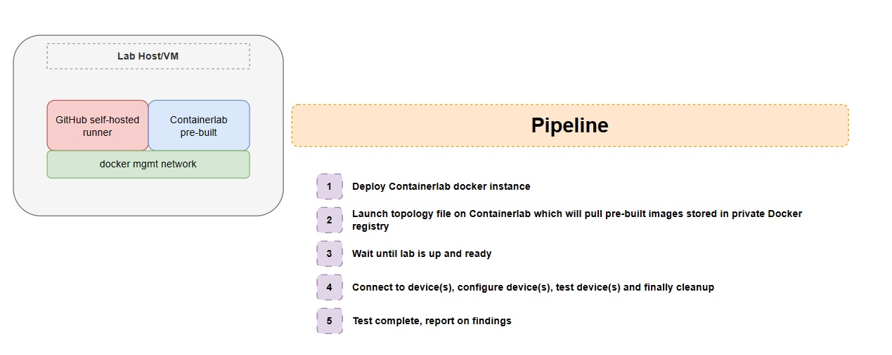
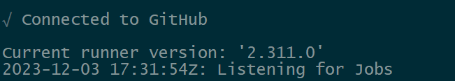
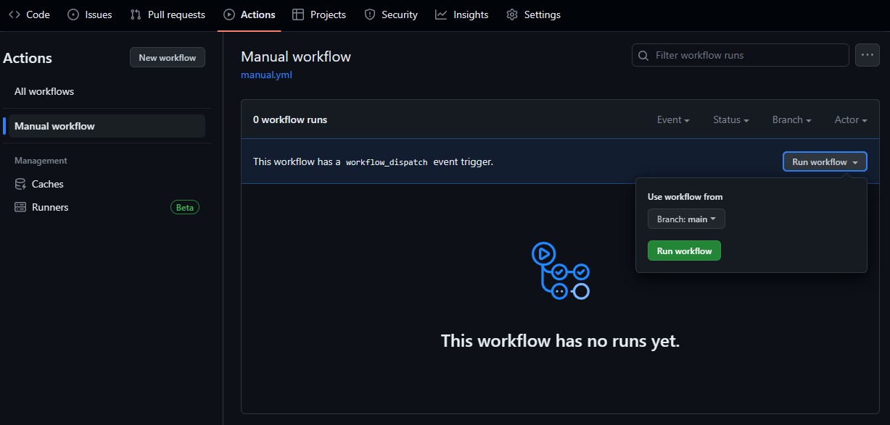
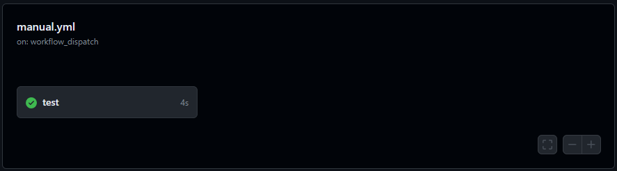
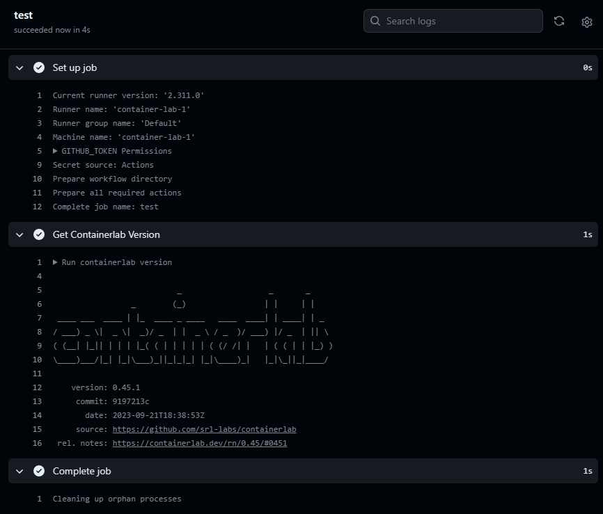
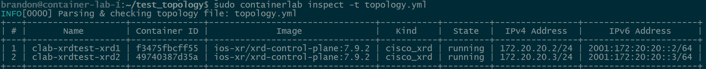
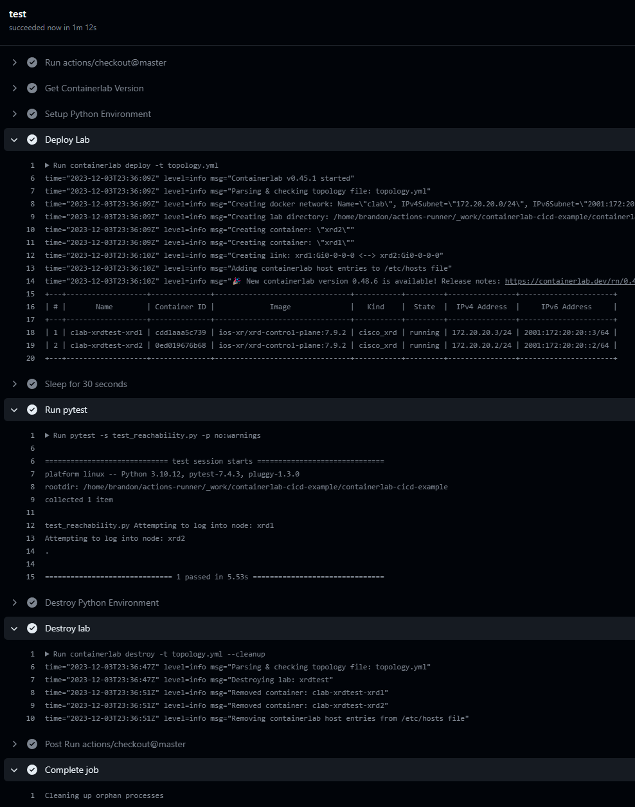

I've been using containerlab for quite some time now, I've had ups and downs with this project and running into some issues during its development but I always go back to it purely because of the native docker support to run container based network operating systems, especially studying for my CCIE SP, the XRd requirements are very appealing for building large labs and throwing in 1 or 2 XRv9Ks converted into a container based image using vrnetlab is just better than running old 32 bit XR and more XRv9ks than my server can handle.

I've seen very few examples of using containerlab in the CI/CD process and thought it'd be cool to do it myself and write a blog at the same time, so this post will be me in realtime experimenting and trying to solve many issues without going too much into the whole argument on which test framework is better, should I use SSH/NETCONF/RESTCONF or this languages model or that orchestrator, we're going to keep it simple and use Python + Pytest because how easy it is to read for a network engineer with 0 experience with programming/code and then maybe take a look at something like pyATS or robot framework. I'll probably opt to use SSH with Netmiko for the initial testing concept as this tends to be the option everyone goes for when first learning (if it isn't Ansible) before going into NETCONF/RESTCONF/Orchestrators/building their own logic/lifecycle of network configuration. Let's get straight to my thinking process...

## First things first... Infrastructure???

Ok, so what about infrastructure? We want to build a pipeline which spins up an instance of Containerlab, maybe builds an image, we pass a topology file, then start to do things... right? I can already see this being slow, now we're not looking for ultimate speed (because why would we use Python, am I right?) but repeating this process over and over again is going to add time to our pipeline process so the first thing I am thinking is this:



Containerlab runs docker images, some vendors are naughty and don't provide native images or at least very bare minimum where we need to do some tweaking of variables or settings to get it into a runnable state, others are fantastic and let you pull the image publicly without having a license or agreement. In my case, I'm going to build the XRd container and put it into a private registry so that I can simply pull it so I don't have to waste precious time building a docker image that builds everything for me every time I pull it, so the host running the GitHub self-hosted runner will be able to call containerlab directly, let's try and get a basic topology up and running with virtual images that we don't need to build for now, the download is straight forward as they provide a bash script, you can [find the installation process here on their website](https://containerlab.dev/install/).

After running through the installation process, (which I already had an instance of containerlab setup), we can begin on the GitHub self-hosted runner. If you are using GitLab, they provide a native docker image which was the idea to share the docker network between a containerlab dockerized image and the self-hosted runner container, we would probably need to deploy dind (docker-in-docker, because containerlab uses docker in our instance...) however in a real lab, I would expect a VM dedicated with containerlab pre-installed with images already loaded into Docker to speed up the CI/CD process.

```
brandon@container-lab-1:~$ containerlab version

                           _                   _       _     
                 _        (_)                 | |     | |    
 ____ ___  ____ | |_  ____ _ ____   ____  ____| | ____| | _  
/ ___) _ \|  _ \|  _)/ _  | |  _ \ / _  )/ ___) |/ _  | || \ 
( (__| |_|| | | | |_( ( | | | | | ( (/ /| |   | ( ( | | |_) )
\____)___/|_| |_|\___)_||_|_|_| |_|\____)_|   |_|\_||_|____/ 

    version: 0.45.1
     commit: 9197213c
       date: 2023-09-21T18:38:53Z
     source: https://github.com/srl-labs/containerlab
 rel. notes: https://containerlab.dev/rn/0.45/#0451
```

Note: All configuration and scripts I've created on [this post can be found here](https://github.com/BSpendlove/containerlab-cicd-example).

Let's install the GitHub self-hosted runner and assign it to our repository in GitHub... When you create a repository, you can go into `Settings` -> `Actions` -> `Runners`, click `New self-hosted runner` and run through the process to install it on a host. This then appears as a runner which we can use on our Actions and I'm thinking if its anything like GitLab, we should be able to run shell commands and directly call Containerlab, now it would be nice if we built a custom action that would build containerlab and perform all of this in a separate environment but it's 5:30pm on a Sunday and I fancy getting some sleep tonight, maybe next time I will write another post with this and we'll use everything learned in this post :-)



## Workflow Concept

Using the keyword `self-hosted` under the `runs-on` option, we can run commands directly on the host, for the demonstration purpose this is fine but you can see why this would be a bit risky, Containerlab requires sudo (maybe with a bit of permissions and tweaking you can get the runner to run it without sudo) but let's try this on a [manual trigger (using `workflow_dispatch`)](https://docs.github.com/en/actions/using-workflows/events-that-trigger-workflows#workflow_dispatch) for now to list the containerlab version.

```yaml
# .github/workflows/manual.yml

name: Manual workflow
on:
  workflow_dispatch:
jobs:
  test:
    runs-on: self-hosted
    steps:
    - name: Get Containerlab Version
      run: containerlab version
```

Here we can trigger our manual workflow, of course the sky is the limit (unless you have 512MB RAM) and we could trigger this on configurations pushed into a config repository and apply the configuration to a test device purely for the purpose of validating any syntax errors, or if a BGP neighborship comes up, but then we need to be very modular with building our tests unless you are strictly building your whole infrastructure as code, a lot of the time I still see on demand tests being created for a one time use and people rewrite the test from scratch or copy+paste the old test and change some variables like interface names, IP addresses etc...


The most basic test passed, I'd be shocked if it didn't...



and here we have our output of the command as expected...



## Base Concept - ✅

We have our "base concept" here, we are able to run commands from a workflow and produce results, so technically its now a matter of writing a quick topology file, launching it with the workflow, checking when everything is up and running, logging into the devices to push a few commands, check they were pushed correctly and run a test to confirm reachability (eg. pinging between a p2p). There are many parsers and modules out there with Python that can achieve a lot of this but the concept is to show the workflow process and not focus on a specific module as mentioned at the start of the post. I've already built XRd containers locally on the runner host a few weeks back (was a containerlab host) but if you want to test something without building it, you can probably use srlinux which you can pull straight away without authenticating or having a license/agreement to download the container image.

```yaml
# topology.yml

name: xrdtest

topology:
  nodes:
    xrd1:
      kind: cisco_xrd
      image: ios-xr/xrd-control-plane:7.9.2
    xrd2:
      kind: cisco_xrd
      image: ios-xr/xrd-control-plane:7.9.2

  links:
    - endpoints: ["xrd1:Gi0-0-0-0", "xrd2:Gi0-0-0-0"]
```



We would need to write more logic to confirm the device is reachable and potentially even write our own healthcheck to confirm the reachability of these devices before running a test script, containerlab will export some metadata about the topology in a json file inside the lab directory so we can build a quick python script to parse this for us. Let's create a pytest environment and write some functions to parse this data, log into the devices to confirm connectivity and check the OS version / uptime.

## Basic pytest example

Netmiko already comes with pyyaml (which we can use to load our initial topology file to find the lab directory based on the topology name), I'm also going to install pyats and genie to parse the data for me manually, this is where I would recommend things like NETCONF/RESTCONF, as even if you are not directly loading the YANG models, the data is much more structured and you can convert XML to JSON/dictionary (with the exception of sometimes the data model gets a bit cloudy if you have a leaf-list and only 1 item vs multiple, xmltodict for example doesn't know if the leaf item should be a list of items or just a dictionary but there are many ways around this using `force_list` argument. Anyway going a bit off topic now...)

What I've installed in my env environment:
- pip install [netmiko](https://github.com/ktbyers/netmiko)
- pip install [pyats](https://developer.cisco.com/docs/pyats/)
- pip install [genie](https://developer.cisco.com/docs/genie-docs/)
- pip install [pytest](https://docs.pytest.org/en/7.4.x/)

[PyATS](https://developer.cisco.com/docs/pyats/) is a separate testing framework but for ease, I will demonstrate a basic pytest function as its much easier than PyATS to get setup for a concept.

```python
# test_reachability.py
import json
import yaml
from pathlib import Path
from netmiko import ConnectHandler


def load_topology(
    topology_file: str = "topology.yml",
    lab_directory_prefix: str = "clab-",
    topology_json_file: str = "topology-data.json",
) -> dict:
    """Attempts to load the Containerlab topology along with the topology data

    Args:
        topology_file:          File path of the YAML topology
        lab_directory_prefix:   Prefix to search based on the topology name, by default lab directory is 'clab-<name of topology>'
        topology_json_file:     Name of the JSON topology file auto-generated by Containerlabs
    """
    try:
        with Path(topology_file).open() as yaml_file:
            topology = yaml.safe_load(yaml_file)
    except FileNotFoundError:
        exit(f"Unable to find topology file called {topology_file}...")
    except Exception as err:
        exit(f"Unable to load YAML topology due to {err}")

    topology_name = topology["name"]
    lab_directory = Path(lab_directory_prefix + topology_name)
    if not lab_directory.exists():
        exit(f"Lab directory {lab_directory.name} does not exist")

    json_topology_file = lab_directory.joinpath(topology_json_file)
    if not json_topology_file.exists():
        exit(f"JSON Topology  file {json_topology_file.name} does not exist")

    with json_topology_file.open() as json_file:
        json_topology = json.load(json_file)

    return json_topology


def test_reachability(topology: dict = load_topology()):
    assert topology
    nodes = topology["nodes"]
    for node, node_data in nodes.items():
        print(f"Attempting to log into node: {node}")
        with ConnectHandler(
            **{
                "host": node_data["longname"],
                "username": "clab",
                "password": "clab@123",
                "device_type": "cisco_xr",
            }
        ) as ssh_session:
            version = ssh_session.send_command("show version", use_genie=True)
            assert version.get("operating_system") == "IOSXR"  # Validate IOSXR device
```

## Integrating the test into the GitHub workflow

Now we need to kick off this script, we will purposely wait 30 seconds before attempting to start, assuming the containers boot properly but in production we would of course validate connectivity and perform some pre-checks, potentially even attempting 2-3 times and having a timer to sleep until maximum retry number we set has been reached and we deem the container not reachable (or at least the SSH connectivity is broke)... The problem with this is there is no set standard on how to properly test network connectivity for various network operating systems, however a simple ICMP and then control-plane connectivity with SSH authentication (or even logging in with NETCONF and seeing the server capabilities in the `<hello>` messages exchanged would be enough...). Again another blog post or story for the future...

My self-hosted runner already has python3 and python3-venv to create a virtual environment, so I'm going to amend our workflow to create this environment, activate it, install the requirements.txt, run the pytest and then cleanup the .venv after. With an upload of a [requirements.txt that looks like this](https://raw.githubusercontent.com/BSpendlove/containerlab-cicd-example/main/requirements.txt), our workflow now becomes this:

```yaml
# .github/workflows/manual.yml
name: Manual workflow
on:
  workflow_dispatch:
jobs:
  test:
    runs-on: self-hosted
    steps:
    - uses: actions/checkout@master
    - name: Get Containerlab Version
      run: containerlab version
    - name: Setup Python Environment
      run: |
        python3 -m venv .venv
        source .venv/bin/activate
        echo PATH=$PATH >> $GITHUB_ENV
        pip install -r requirements.txt
    - name: Deploy Lab
      run: containerlab deploy -t topology.yml
    - name: Sleep for 30 seconds
      run: sleep 30s
    - name: Run pytest
      run: pytest -s test_reachability.py -p no:warnings
    - name: Destroy Python Environment
      run: rm -r .venv || true
      if: success() || failure()
    - name: Destroy lab
      run: containerlab destroy -t topology.yml --cleanup
      if: success() || failure()
```



As you can see from the screenshot, we have successfully logged into both nodes and the operating_system variable did return IOSXR for both nodes.

## What's next?

I tend to put a lot of my blog posts into multiparts and then don't ever post part-x, only part-1. So apologies in advanced if I do this, however don't let this blog fool you in thinking you must use ONLY GitHub Actions + Python (Netmiko). Containerlab is a brilliant step up from fully fledge QEMU and KVM emulations because firstly, it utilizes something we've all already played around with, Docker. If you haven't played around with Docker yet and are in the industry, read up a blog online, learn how to run a simple whoami container or a simple "Hello World" web server because expanding your knowledge from just `interface g1.... ip address x.x.x.x 255.255.255.254 or set protocols bgp juniper is for nerds` into this realm is almost how I would imagine a few sniffs of cocaine would be, this stuff gets me high and crazy for more knowledge, back to containerlab anyway... Having a binary so lightweight which utilizes the Docker engine and gives us an easy way to define network topologies and run containerized network OS's is such a gift to the networking community, don't get me wrong now... You're not going to get the same experience testing hardware scenarios with certain Broadcom or vendor silicon chipsets, majority of the control plane functionality which is processed by the general CPU in these network devices I personally think are fine to test in the virtualized version of the software, even better when vendors build containerized versions of their own OS. However, this doesn't stop you building a lab physically and having a pipeline to trigger a fresh topology from scratch over console or using startup configurations and validating a base configuration is working for you to being further validation and testing.

My plan over the next few weeks is to look more into the various frameworks offered and get opinions/feedback on what the industry is using whether it be their own tools integrated with frameworks, or trying to fully adopt a framework with little to no python code, so they can just focus purely on the topology configuration, the framework abstracted language and then the CI/CD application language (eg. GitHub vs GitLab vs Jenkins vs CircleCI vs Travis... and many more). I would be interested to know if network orchestration tools (eg. Cisco NSO/Crossworks, Junipers Contrail, etc..) are building the functionality to be able to test deployments on a lab infrastructure before deploying the configuration to a real device, are people actually pushing hard for these tests or just spinning up a XYZ Vendor box and just validating it takes the configuration without any syntax errors before deploying to production? 2 boxes with the same software revision, firmware revision and same platform/hardware on the network may just act differently sometimes due to an underlying configuration difference, here we get into the realm of a source of truth and intended configuration vs real state but I will leave this post here and any feedback/corrections you may have, then please feel free to comment or message me directly via my contact details.